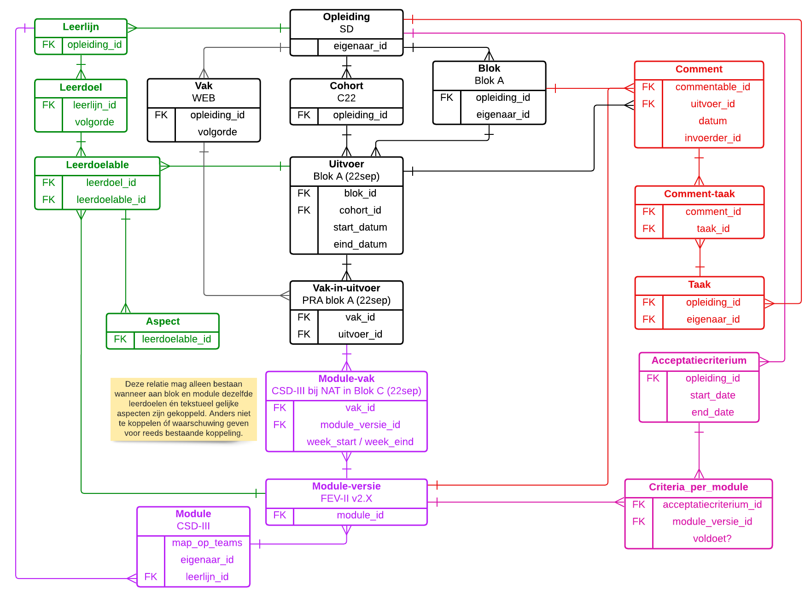

# Status 06-feb-2023
* Je kunt nu blokken en vakken maken.
* Je kunt een cohort maken en daar blokken aan koppelen, zodat uitvoeren ontstaan.
* Je kunt een cohort kopieeren (alle uitvoeren worden gekopieerd).
* Je ziet op de homepage de actuele uitvoeren.
* Je kunt een uitvoer bekijken; je ziet dan de vakken en modules van die uitvoer.
* Je kunt nog NIET de vakken/modules van een uitvoer toevoegen/wijzigen/verwijderen.
* Kopieer-actie cohort werkt NIET door op gekoppelde vakken/modules (kopieert nu lege uitvoeren)

# Backlog

Doel van de app: het team krijgt eigenaarschap over de staat van het onderwijs. Dit ligt niet bij één persoon maar is voor iedereen inzichtelijk en het proces hieromheen is gestroomlijnd.

* Als admin van de app wil ik:
  * Teams maken (bijv.. TT-SD, TT-BBO, enzovoort).
  * Een opleiding koppelen aan een team (één opleiding heeft één team).
  * Gebruikers koppelen aan een team (veel-op-veel), zodat bijhorende opleidingen kunnen zien.
  * Andere gebruikers admin maken.
* Als onderwijscoördinator wil ik de structuur inrichten, zodat mijn collega's hun werk kunnen doen (commentaar invullen, enzovoort).
  * Dit mag niet teveel tijd kosten > oplossing: structuur is geheel kopieerbaar en bij wijzigingen wordt gevraagd "wil je wijzigen voor alleen deze uitvoer, of ook toekomstige?"
  * Zie ERD (zwarte deel) voor hoofdstructuur, waarbij geldt: een "uitvoer" is een blok-in-een-jaar. Dus niet een globaal blok, maar specifiek "Blok X (2022-sep)".
  * Wanneer het aantal blokken van een opleiding verandert, of er een heel nieuw blok bijkomt bijvoorbeeld, dan is het dús een hele nieuwe opleiding.
* Als blok- of module-eigenaar wil ik zien van welke modules ik eigenaar ben, zodat ik me daarop kan focussen.
  * Eigenaarschap is niet uitvoer-gebonden. Zodra de eigenaar wisselt, vallen alle historische en toekomstige verantwoordelijkheden over op de nieuwe eigenaar.
  * Een blok of module zonder eigenaar komt op een waarschuwingslijst en default voorlopig naar de opleidingseigenaar.
* Als docent wil ik na/tijdens het uitvoeren van een module opmerkingen kunnen noteren, zodat de lessen voor een volgende uitvoer beter worden.
  * Ik zie hiervoor het leer/toetsplan waarbij ik een module of het gehele blok kan aanklikken (comment-knop).
  * Een opmerking is gekoppeld aan een module of blok (=uitvoer).
  * En ook gekoppeld aan een uitvoer, zodat herleid kan worden wanneer de opmerking ontstond.
  * Verder noteren we datum+invoerder van opmerking.
* Als blok- of module-eigenaar wil ik na afloop van een uitvoer al het commentaar zien voor mijn eenheden (wel per eenheid apart), zodat ik comments kan groeperen tot SMART-geformuleerde taken.
  * 'Al het commentaar' betekent: al het commentaar van deze én vorige uitvoeren, voor zover dat nog niet de status 'afgehandeld' heeft.
  * Zodra commentaar wordt gelinkt aan een taak, krijgt het de status 'afgehandeld'.
* Als gebruiker van de app wil ik alle taken zien op één takenbord, zodat ik kan zien wat de status is van de opleiding als geheel, en ook wie waar mee bezig is en welke taken nog niet zijn toegewezen (waar ik eventueel kan helpen).
  * In principe is dit overzicht weergegeven als kanban-bord, met de blokken en leerlijnen als kolommen.
  * Mogelijk later (could-have) nog opties om anders te groeperen/sorteren/filteren.
* Als onderwijscoördinator wil ik diverse rapportages over het ingevulde commentaar en de gemaakte taken kunnen bekijken, zodat ik weet wat de status is.
  * Taken niet toegewezen
  * Aantal comments per element niet toegewezen (op niveau van blok/vak/module, waarbij op niveau van vak bijvoorbeeld alle onderliggende modules worden opgeteld).
  * Taken over datum
  * Taken die inactief zijn (wel gemaakt, maar al lang geen activiteit meer op)
  * Aantal taken per persoon
* Als onderwijscoördinator wil ik diverse rapportages over de gebouwde structuur zien, zodat ik kan controleren of alles goed is klaargezet.
  * Lijst van alle uitvoeren waar een vak in voorkomt.
  * Lijst van alle modules onder een leerlijn.
  * Lijst van alle modules onder een vak.
  * Lijst van alle uitvoeren onder een blok.
* Als onderwijscoördinator wil ik aan de opleiding acceptatiecriteria kunnen koppelen, zodat deze voor iedere module(versie) kunnen worden afgevinkt.
  * Zodra je een nieuwe versie maakt voor een module worden de criteria allemaal weer ongeldig; de module moet opnieuw worden gecontroleerd.
  * Bij een versie van een module zijn alleen de criteria zichtbaar die actief waren op het moment dat de bewuste module-versie werd gemaakt.
* Als onderwijscoördinator wil ik leerlijnen met daaronder leerdoelen toevoegen aan de opleiding, zodat we deze centraal kunnen beheren.
  * Koppelen aan uitvoeren en modules
  * Aan die koppeling zijn weer aspecten gekoppeld
  * Export t.b.v. Itslearning
    * Samenwerking met app van Tim?! Zodat het direct kan worden ingelezen als aspecten..
  * Diverse rapportages
  * Leerdoel kan niet wijzigen. Opleiding kent leerdoelen, die kun je archiveren of nieuwe maken. Stel dat 11.02 niet meer klopt, wordt het dus bijvoorbeelds 11.36.
    * Let wel; voor correcte weergave moeten we dan ook LU's een volgorde mee kunnen geven (zodat 11.36 nog steeds bovenaan staat, want is eerste stap van K1-W1).
    * Een uitvoer kent dan verschillende LU's die simpelweg niet kúnnen wijzigen.

# ERD

[Volledig ERD op LucidChart](https://lucid.app/lucidchart/b64482a9-95fb-46fe-bef5-d679b203f222/edit?invitationId=inv_ab7f8d7b-f481-4027-b2ac-2af9fdbedf12)

# Klad

## Details m.b.t. kopiëren en aanpassen toekomst

Idee van cascade loslaten? In plaats daarvan.. Alle links zijn gelegd enzovoort, en wanneer je iets aanpast in een uitvoer, krijg je de vraag;

- [X] Voor deze uitvoer
- [ ] Historische uitvoeren (_kan eigenlijk niet?!_)
- [ ] Voorliggende maar nog toekomstige uitvoeren
- [ ] Hierna liggende uitvoeren

Vanuit het blokscherm kun je dus de vraag krijgen "Je gaat module WED-II met een week vervroegen in uitvoer 22sep". Wil je dit ook aanpassen voor.... (alle bovenstaande opties).

Hiervoor moet een uitvoer dus ook echt een startdatum hebben (zodat je weet of de uitvoer historisch is (en dus gelockt) of niet). Ook onderscheid maken tussen lopende cohorten en toekomstige cohorten!

In het blokscherm kun je van een module alleen aanvinken welke versie je wil gebruiken. Ook daarvoor krijg je bovenstaande vraag.
