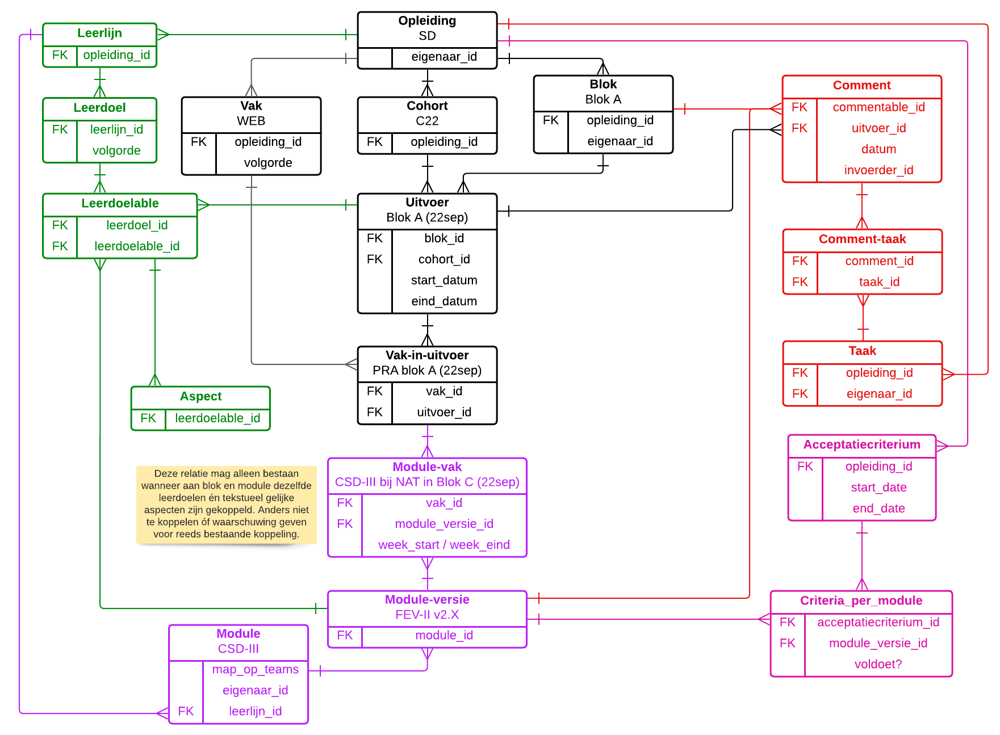

# CurrApp `v3`

Doel van de app: het team krijgt eigenaarschap over de staat van het onderwijs. Dit ligt niet bij één persoon maar is voor iedereen inzichtelijk en het proces hieromheen is gestroomlijnd.

## Getting started

1. Clone the repository
2. Install JS dependencies: `npm install`
3. Install PHP dependencies: `composer install`
4. Copy `.env.example` to `.env` and fill in the values
5. Don't forget to `php artisan key:generate`
6. Migrate and seed the database: `php artisan migrate --seed`
7. Start this apps front-end compiler: `npm run dev`
8. Start this apps back-end server: `php artisan serve --port=8080` (Port is different due to its relation to smartpoints)
9. Go to `localhost:8080` in your browser

## ERD

> [!WARNING]
> Niet geheel up-to-date meer.



## API

`/api/v1/` is de prefix voor alle API-calls.

Voor toegang tot de API is een API token nodig. Deze vraag je op voor jezelf door ingelogd naar deze route te gaan: `/tokens/create`.
Stuur in alle verzoeken de header `Authorization` met waarde `Bearer #|####` (waar `#|####` jouw API token is).

### Feedbackmomenten

#### GET `/api/v1/feedbackmomenten/active-sorted-by-module`

Geeft alle actieve blokken, met vakken, modules, en daarin feedbackmomenten terug.

**Voorbeeld uitvoer:**

```json
[
    {
        "blok": "Blok B",
        "datum_start": "2023-08-01T00:00:00.000000Z",
        "datum_eind": "2024-02-01T00:00:00.000000Z",
        "vakken": [
            {
                "vak": "NAT",
                "volgorde": 3,
                "modules": [
                    {
                        "module": "LHK-I",
                        "leerlijn": "LHK",
                        "week_start": 1,
                        "week_eind": 5,
                        "feedbackmomenten": [
                            {
                                "code": "FDJG",
                                "naam": "Quam et qui.",
                                "week": 12,
                                "points": 10
                            }
                        ]
                    },
                    {
                        "module": "FBE-IV",
                        "leerlijn": "FBE",
                        "week_start": 6,
                        "week_eind": 16,
                        "feedbackmomenten": []
                    }
                ]
            },
            // ...
        ]
    }
]
```
