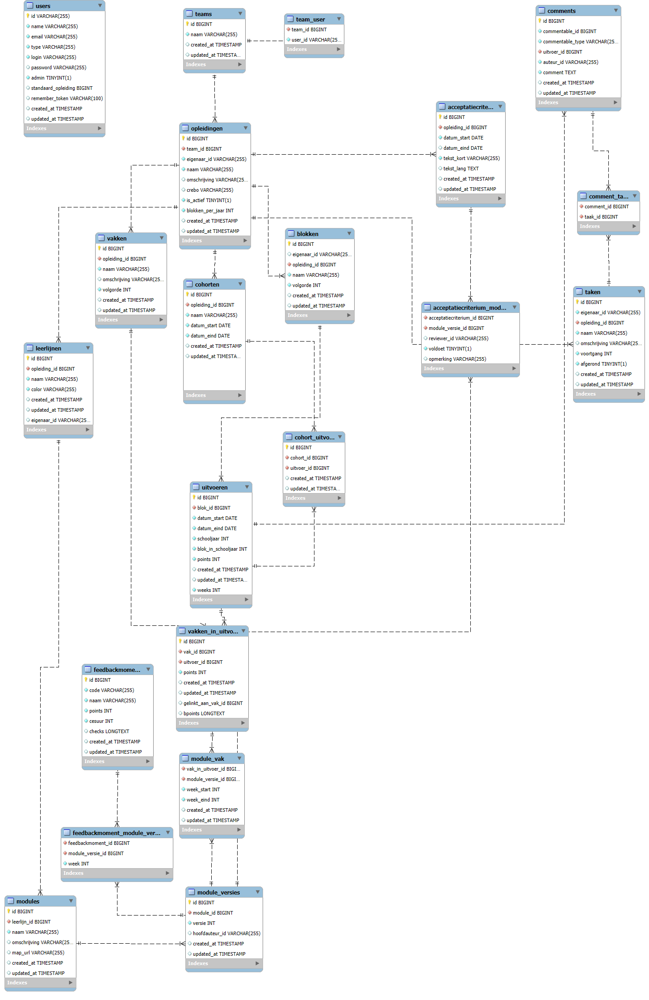

# Backlog

Doel van de app: het team krijgt eigenaarschap over de staat van het onderwijs. Dit ligt niet bij één persoon maar is voor iedereen inzichtelijk en het proces hieromheen is gestroomlijnd.

* Als onderwijscoördinator wil ik de structuur inrichten, zodat mijn collega's hun werk kunnen doen (commentaar invullen, enzovoort).
  * Zie ERD (zwarte deel) voor hoofdstructuur, waarbij geldt: een "uitvoer" is een blok-in-een-jaar. Dus niet een globaal blok, maar specifiek "Blok X (2022-sep)".
* Als vakeigenaar wil ik zien van welke vakken en modules ik eigenaar ben, zodat ik me daarop kan focussen.
  * Eigenaarschap is niet uitvoer-gebonden. Zodra de eigenaar wisselt, vallen alle historische en toekomstige verantwoordelijkheden over op de nieuwe eigenaar.
  * Een blok bestaat uit vakken, een vak bestaat uit modules. Een vak _moet_ een eigenaar hebben. Wanneer een module geen eigenaar heeft, dan default de eigenaar naar die van het vak.
* Als docent wil ik na/tijdens het uitvoeren van een module opmerkingen kunnen noteren, zodat de lessen voor een volgende uitvoer beter worden.
  * Een opmerking is gekoppeld aan een module, vak of blok.
  * En ook gekoppeld aan een uitvoer, zodat herleid kan worden wanneer de opmerking ontstond.
  * Verder noteren we datum+invoerder van opmerking.
* Als blok/vak/module-eigenaar wil ik na afloop van een uitvoer al het commentaar zien voor mijn eenheden (wel per eenheid apart), zodat ik comments kan groeperen tot SMART-geformuleerde taken.
  * Al het commentaar betekent: al het commentaar van deze én vorige uitvoeren, voor zover dat nog niet de status 'afgehandeld' heeft.
  * Zodra commentaar wordt gelinkt aan een taak, krijgt het de status 'afgehandeld'.
* Als gebruiker van de app wil ik alle taken zien op één takenbord, zodat ik kan zien wat de status is van de opleiding als geheel, en ook wie waar mee bezig is en welke taken nog niet zijn toegewezen (waar ik eventueel kan helpen).
  * In principe is dit overzicht weergegeven als kanban-bord, met de blokken als kolommen.
  * Mogelijk later (could-have) nog opties om anders te groeperen/sorteren/filteren.
* Als onderwijscoördinator wil ik diverse rapportages over het ingevulde commentaar en de gemaakte taken kunnen bekijken, zodat ik weet wat de status is.
  * Taken niet toegewezen
  * Aantal comments per element niet toegewezen (op niveau van blok/vak/module, waarbij op niveau van vak bijvoorbeeld alle onderliggende modules worden opgeteld).
  * Taken over datum
  * Taken die inactief zijn (wel gemaakt, maar al lang geen activiteit meer op)
  * Aantal taken per persoon

# ERD

# Klad (nog uitwerken tot userstories)

## Beheer LU's (blauw)

Ook een plek voor beheer LU's en aspecten
LU's beheerd op centraal niveau.
Die zijn dan gekoppeld aan blokken (zodat je ook rapporten kunt draaien hierop)
Per blok kun je dan aspecten invullen / kopiëren vanuit andere blokken
Voor aspecten cascademodel; nu niet ingevuld = auto overnemen uit vorige uitvoer
Mogelijkheid export (leerlijn nodig, paars/roze)

## Integratie kwaliteitschecklist / acceptatiecriteria (groen)

Iets met checklist onderwijsmateriaal (de acceptatiecriteria). Aangeven of een module daaraan voldoet. Zodra je een versie bumpt wordt dat weer geïnvalideerd en moet je opnieuw aangeven (liefst door iemand anders!).
